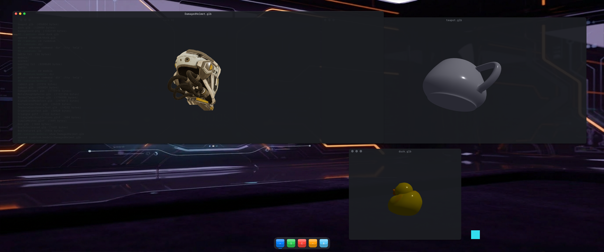

# kudos

**A hobby operating system for AI agents that build their own applications.** It
is written for the interest of writing it, is not a product, and is not offered
as fit for any serious use — see `process.md` for what that does and does not
claim.

An agent living inside the machine takes a request in natural language, writes
Zig, and sends it to an **external build service** over the LAN; kudos carries no
compiler of its own (spec ARCH-012). What comes back is a loadable binary module
the kernel verifies against a versioned ABI and runs as an ordinary application.
The use cases it is shaped around are **OpenGL rendering** ones — the reason the
machine is GPU-first, and the reason a generated app's most interesting move is
to open a window and draw.

Underneath: GRUB multiboot2 boots a Zig kernel into 64-bit long mode and a
high-resolution framebuffer, which hosts a simple GUI — desktop, mouse cursor,
keyboard, and movable terminal windows in a single bitmap font.

The code was written with the help of Anthropic's Claude Code.



*The kudos desktop, composited live by the RTX 4090: a terminal downloading a
page from the dev host over the from-scratch TCP/IP stack (`net fetch`) and
saving it to the in-RAM ramdisk, beside a GPU-rendered `teapot.glb` model
window.*

---

## Requirements

**To build kudos and run it in QEMU** (the quick start below):

- an x86-64 machine running Linux, with KVM available (`/dev/kvm`)
- `sudo`, for one `apt install`
- ~3 GB of free disk

That is all. No GPU, no USB stick, no second machine. Everything else — the
pinned Zig toolchain included — is installed by `make setup`.

**Tested on:** Ubuntu 26.04 LTS (kernel 7.0), x86-64, QEMU 10.2.1, Zig 0.16.0
(pinned by `make setup`), and for the GPU paths an RTX 4090 on the NVIDIA 580.173
driver. Other apt-based distributions should work; on a non-apt one `make setup`
names the packages it needs and stops. Nothing else has been tried, so treat
anything further from that as untested rather than unsupported.

**To run kudos on real hardware** you need the machine it is written for: an
x86-64 PC with a **GeForce RTX 4090** and a USB stick. See
[Hardware support](#hardware-support) for exactly what is driven, and what each
missing part costs you.

## Quick start

```sh
git clone <this repo> kudos && cd kudos
make setup      # once: pinned Zig 0.16.0 + host tools (apt + two checksummed downloads)
make gui        # build the kernel + ISO, then open the kudos desktop in a window
```

`make gui` takes a couple of minutes the first time and ends with a QEMU window
running the kudos desktop. Click a window title bar to drag it; type `help` in
the terminal. Close the window to stop.

Useful next commands:

```sh
make help       # every target, one line each
make build      # just compile both kernels (~1 min)
make test-unit  # the host test suite
make check      # the everyday gate: host tests + the QEMU boot suite
make clean      # back to a fresh checkout
```

If something does not work, `scripts/setup.sh --check` verifies the toolchain
without installing anything.

## Running kudos

There are three ways to run it, in increasing order of hardware required.

### 1. In QEMU — any x86-64 Linux machine

```sh
make gui
```

Builds the ISO and opens an interactive window. Keyboard and mouse go straight
into it. The boot trace leaves the machine over netdebug (UDP :9514) because
kudos has **no serial port** — watch it with:

```sh
socat -u udp-recv:9514,reuseaddr -
```

The desktop here is rasterised on the CPU at 1280×800 (`-Dsoft-display`, which
`make gui` builds for you): no GPU reaches a guest except by passthrough, so a
default image inside QEMU publishes no draw device and the window would be black.
It is a development instrument — it meets none of the 60 Hz present requirements
the GPU path is held to. With no USB stick on the machine the run says so and
boots without `/usbdisk`.

### 2. On the real RTX 4090 — passthrough on this machine

A 4090 cannot be emulated (GSP bring-up needs the real silicon), so kudos takes
the physical card over with VFIO. That means the Linux desktop must come down
first: run this from a **text console** (Ctrl+Alt+F3) or an SSH session, not from
inside the desktop you are about to stop.

```sh
make start GPU=1  # desktop down, card bound to vfio, kudos on your monitors
make stop       # card back to nvidia, Linux desktop back
```

One-time host setup:

1. **Enable IOMMU** in firmware (Intel VT-d / AMD-Vi) and on the kernel cmdline
   (`intel_iommu=on` or `amd_iommu=on`). Check with `dmesg | grep -i IOMMU`.
2. **Confirm the card is alone in its IOMMU group** with its HD-audio function
   (they always share one and move together). With the card at `01:00`:
   ```sh
   for d in 01:00.0 01:00.1; do readlink -f /sys/bus/pci/devices/0000:$d/iommu_group; done
   ```

The card's PCI address is found by device id, so it does not matter which slot
yours is in (`GPU_VGA_BDF` overrides it). `make start` does the same thing but
picks the mode from where you are: over SSH it goes to passthrough, locally it
opens the QEMU window.

A healthy run logs `gpu: GSP init bring-up result: ok` on the trace, and the
display test logs the head-0 surface readback (a mismatch aborts with
`SurfaceReadbackMismatch`). `make start GPU=1` also **asserts the running guest's
`kudos build #N` banner matches the ISO it just built**, so a stale ISO cannot
silently be what you tested. The card is released back to nvidia on every exit
path it handles, Ctrl-C included.

If a run ever leaves the card stuck:

```sh
sudo scripts/gpu/health.sh check   # report driver/power/link (non-destructive)
sudo scripts/gpu/health.sh reset   # wake from D3hot, then reset in place
make stop                          # full restore: FLR → Secondary Bus Reset if needed
```

`health.sh` deliberately never rebinds the nvidia driver — doing that via sysfs
runs GPU init inside the write and can spin unkillably and block a reboot. Moving
the card between drivers is `scripts/gpu/bind.sh` / `unbind.sh`. The rationale for
`x-vga=on`, for no emulated VGA, and for the bind mechanics is in the GPU driver's
own module comments (`src/drivers/gpu/`).

### 3. Bare metal — installed into your GRUB menu

```sh
make boot       # root: stages both kernels + GSP firmware into /boot, regenerates the menu
                #   SOFT=1 if this machine has no 4090 (else bare metal draws nothing)
```

Reboot and pick `kudos (Build N)` or `kudos-smp (Build N)`. This is the real
thing: your GPU, your NIC, your USB stick, no emulator underneath. The install is
idempotent and additive — it never edits your other OS entries — so re-run it
after each rebuild.

### The agent's build service

kudos carries no compiler, so nothing the in-kudos agent writes can run until the
external build factory is up. It is a digest-pinned container (docker required)
that compiles POSTed Zig into a loadable `.kudos` module, with this repo mounted
read-only.

```sh
make factory-setup   # once: build the image
make factory         # serve it on :8623
```

Then `ai <what you want>` inside kudos, and `run` / `feature` to execute what
comes back.

## Hardware support

kudos drives specific silicon, not a class of it. The setup it is written for is
**one PC**: an x86-64 box with an RTX 4090 in it and a USB stick plugged into it.

| Part | What kudos drives | Without it |
|---|---|---|
| **CPU** | x86-64 with KVM (`/dev/kvm`). Intel VT-x for the `vm` hypervisor — VMX only, there is no AMD-V path | AMD hosts build, boot and render; `vm` (the Linux-guest hypervisor) does not run |
| **GPU** | **GeForce RTX 4090 only** (Ada AD102, PCI `10de:2684`), driven through its GSP firmware | No hardware rendering. Under QEMU, build with `-Dsoft-display` (what `make gui` does) and the desktop is rasterised on the CPU |
| **GPU firmware** | The host's own NVIDIA driver tree, `/lib/firmware/nvidia/ad102/gsp` — staged into the ISO, never vendored here | A firmware-free ISO that boots fine and skips GPU bring-up |
| **Network** | Intel only: e1000 (`8086:100E`, QEMU's card) and the igb/igc family incl. I225/I226. **This is also the only console** — the trace leaves over UDP, there is no serial port | A Realtek/Broadcom/Wi-Fi NIC means no network *and no boot trace* on bare metal. Under QEMU the emulated NIC is always an e1000, so this only bites on real hardware |
| **USB** | Any xHCI controller (PCI class `0C/03/30`). Keyboard and mouse are **USB HID only** — kudos has no PS/2 driver | No input and no storage: a machine whose only keyboard is PS/2 cannot be typed into |
| **Storage** | USB mass storage, FAT16/32, mounted at `/usbdisk`. Any size up to `-Dusb-max-gb` (default 2000 GB) | kudos boots and says so; `/usbdisk` is absent, and the ramdisk is the only filesystem |
| **Display** | The framebuffer GRUB hands over (multiboot2), at whatever resolution the firmware offers | — |
| **RAM** | 8 GB is enough; an emulator run sizes the guest at half the host's RAM (8–64 GB, `MEM_GB` overrides) | — |
| **Firmware** | Legacy BIOS or UEFI — the ISO carries both boot paths | — |

### The USB stick

Any ordinary stick, not a designated one. Give it a GPT/FAT32 data partition
labelled `KUDOSUSB`, then:

```sh
make usbdisk-provision   # writes the files the test suites expect
```

Two knobs, both defaulted to the reference machine's stick, both plain
environment variables (`scripts/gpu/env.sh`):

- `USB_STICK_VID` / `USB_STICK_PID` — which device QEMU passes through. `lsusb`
  prints the pair.
- `-Dusb-max-gb` (kernel build option, default 2000) — the size above which a USB
  device is assumed to be somebody's *drive* and left alone. USB storage is the
  only storage kudos can reach (there is no NVMe or AHCI driver), so this ceiling
  is what keeps it off your disks.

## Testing

| Target | What it does | Needs |
|---|---|---|
| `make test-unit` | Host unit tests: pure logic **and the silicon truths** (the xHCI 64 KiB rule, completion codes, the DHCP lease rule) | nothing |
| `make check-fast` | Every host track — unit tests, the layering gate, the API-surface snapshot, stack-depth and mutation checks | nothing |
| `make check` | **The everyday gate.** The host tracks plus the QEMU boot suite | the USB stick, for the boot suite |
| `make status` | Reads the test register (~1 s): what has passed against this exact tree, what is stale | nothing |
| `make test-guest-qemu` | Nested: kudos boots a Linux guest, under QEMU. The one suite needing no hardware beyond KVM | `scripts/virt/build_guest.sh` run once (a kernel build) |
| `make test-agent` | The agent pipeline on the host: factory + loader + full agent loop | zig |
| `make test-boot B=1` | Shell + window-manager suite against a full boot in QEMU | the USB stick |
| `make test-boot B=2` | The real 4090 under QEMU passthrough | the 4090 (`make rig` first) |
| `make test-boot B={1,2,3} ON=native` | The same suites on **bare metal**, netbooted | the remote rig below |
| `make shot` | One command: screenshot a model rendered on the 4090 | the 4090 + the stick |

Tests are **register-incremental**: `build/verified/` records the content digest
each passing track covers, so a re-run only repeats what went stale. "Fast" in
`check-fast` means *skips the emulator*, not quick — from a cold cache it compiles
and runs every host suite plus the mutation checks, about 17 minutes on a 14-core
laptop. Once green, a re-run against an unchanged tree takes about a second, and
after an edit only the tracks covering what you touched run again. `make status`
reads the register without running anything.

**Why the gate exists.** Most of what breaks kudos on real silicon is invisible in
emulation: QEMU does not enforce the xHCI 64 KiB TRB-boundary rule, never runs the
igc NIC at all, and reports Success where a real controller reports Short Packet.
Green host tests and a green QEMU boot genuinely do not mean the real build works —
so `make check` refuses to pretend otherwise, and names the track you still need to
run. `make check-hw` is the final gate: it additionally requires the bare-metal
tracks to have passed against this exact tree.

## Development

**Use the `Makefile`.** It is the front door — a thin convenience layer over
`build.zig` + `scripts/`, which are the single sources of truth. Targets delegate;
they never reimplement build logic. `make help` lists them all. You can call
`zig build …` and `scripts/*.sh` directly, but the Makefile is the intended
interface.

Two kernel variants share one source tree: **`kudos`** (single-core, BSP only) and
**`kudos-smp`** (multi-core: brings the APs online and pins one terminal per core).
Every build builds both.

`make clean` returns the tree to a fresh checkout: `build/`, both zig caches, the
test register, the staged Linux guest, and every other generated artifact. Your
`.env` and editor config are left alone.

**Seeing kernel logs:** module logging is GATED — `gate.enable(&.{…})` in
`src/main_root.zig` is the whole list of what an image logs, and anything outside
it is dropped silently. On by default: `.usb .gpu .term .ui .net .pci .mem .boot`,
so GSP boot and flip timing appear. Not on by default: `.irq .sched .smp .cpu
.acpi` — add them and rebuild if you need them. If a subsystem looks dead, check
the gate before you believe it (`src/kernel/debug/gate.zig`).

**Documentation** lives in code comments at the owning module: each subsystem's
`.zig` files describe both how the module is built and the behaviour it presents.
There is no separate `design/` tree and no checked-in reference
extracts — the source is the record. Where a register layout or protocol constant
came from a specification, the owning module names the specification and section
in place. `specs/` holds the requirements, one file per package, indexed by
`spec.md`; `process.md` describes how the project is developed and what it claims.

### Dependencies

`make setup` installs all of these and is idempotent. They are listed because most
fail in a way that does *not* name the missing tool:

| Tool | Needed by | Package |
|---|---|---|
| Zig 0.16.0 | everything | *(ziglang.org — not in the archive; `make setup` fetches it)* |
| `make`, `curl` | this Makefile; fetching the toolchain | `make`, `curl` |
| `nasm` | `boot.asm`, `isr.asm`, `trampoline.asm` | `nasm` |
| `grub-mkrescue` | the ISO | `grub2-common` |
| `xorriso`, `mformat` | `grub-mkrescue` shells out to **both** | `xorriso`, `mtools` |
| *(i386-pc modules)* | **the ISO's legacy-BIOS boot path** — see below | `grub-pc-bin` |
| *(EFI modules)* | the ISO's UEFI boot path | `grub-efi-amd64-bin` |
| `zstd` | decompressing the GSP firmware blobs | `zstd` |
| `qemu-system-x86_64` | the emulated boot | `qemu-system-x86` |
| `mkfs.vfat` | the FAT test fixtures | `dosfstools` |
| `socat` | capturing the netdebug trace (:9514) — every test track | `socat` |
| `dnsmasq` | the emulated track's tap needs a DHCP server (KMR1 is unicast) | `dnsmasq` |
| `python3` | the test drivers + the debug channel | `python3` |
| `gltf_validator` | the glTF asset gate (`make test T=gltf-validate`, spec TEST-007) | *(Khronos release — `make setup` fetches it)* |
| `uv` | runs the netdebug MCP server | *(astral.sh — `make setup` fetches it)* |

A bootable ISO needs **two** boot paths built into it: an old-style BIOS one and
a UEFI one. `grub-pc-bin` supplies the BIOS half. If it is missing, the ISO build
still succeeds and still writes `build/kudos.iso` — but that ISO only boots on
UEFI, and QEMU boots it as a BIOS CD, so you get a window that never starts kudos
and no message explaining why. `make setup` installs the package, so this only
bites if you assembled the toolchain by hand; see
[Troubleshooting](#troubleshooting) for the one-line check.

**GSP firmware is NOT vendored.** `mkiso.sh` auto-detects the host's
`/lib/firmware/nvidia/ad102/gsp` (the NVIDIA driver's own tree, ~50 MB
compressed) and stages the five blobs into the ISO as multiboot2 modules. A box
with no NVIDIA driver installed still builds — you get a firmware-free ISO that
boots fine without the GPU. Point `GSP_FW_DIR=` at another tree to override, or
set it empty to force the no-firmware build.

### Troubleshooting

**The QEMU window opens but kudos never starts.** Your ISO is probably missing
its BIOS boot path (see `grub-pc-bin` above). Check it:

```sh
xorriso -indev build/kudos.iso -report_el_torito plain | grep 'boot img'
#   1  BIOS  …  /boot/grub/i386-pc/eltorito.img     <- both lines must be there
#   2  UEFI  …  /efi.img
```

**The window is black, or the desktop never paints.** The image was built without
`-Dsoft-display`. Inside QEMU there is no GPU, and a default image publishes no
draw device — use `make gui`, which builds the right image for you.

**No trace on :9514.** kudos has no serial port; the trace is UDP. Check you are
listening (`socat -u udp-recv:9514,reuseaddr -`) and, on bare metal, that the NIC
is one kudos drives — an unsupported NIC means no trace at all.

**`/usbdisk` is absent.** Either no stick is plugged in (the run says so and
continues), or the stick is larger than `-Dusb-max-gb`, or its data partition is
not FAT32 labelled `KUDOSUSB`. The kernel trace names which.

**The 4090 is stuck after a passthrough run.** `sudo scripts/gpu/health.sh check`,
then `make stop`. See [option 2](#2-on-the-real-rtx-4090--passthrough-on-this-machine).

### Advanced: a two-machine rig

Everything above is one machine. The way this project is actually developed is
two: a laptop to write on, and a headless box (called `lemon` throughout
`scripts/netboot/`) that holds the 4090 and the stick. The box PXE-boots the build
served from the laptop, one-shot, so any later reset returns it to its own OS
unattended — that is what `make netboot-serve`, `make lemon DO=boot` and the
`test-boot-*-native` tracks are for, and what the `LEMON_HOST` / `LEMON_IP`
environment variables point at (an ssh-config entry and working keys are assumed).
None of it is needed for the three options above.

## Principles

- **64-bit only.** GRUB hands off in 32-bit protected mode; a small NASM
  trampoline switches to long mode before any Zig code runs.
- **RAM-first, but not RAM-only.** Kernel state lives in RAM and the ISO is purely
  GRUB's boot medium — but kudos does drive real storage: a USB mass-storage stick
  (`drivers/usb/msc.zig`) with a FAT16/32 driver (`drivers/storage/fat.zig`), mounted
  at `/usbdisk` through a small VFS (`drivers/storage/vfs.zig`).
- **Testable in an emulator.** Each milestone has an emulator check — boot in QEMU
  and read the trace and/or a framebuffer screenshot. There is NO serial port: the
  trace bus is `kernel/debug/klog.zig`, and it leaves the machine over netdebug
  (UDP :9514). See `make check`.

## Status

Milestones M0–M8 are implemented, each with the QEMU check named below. What has
actually passed against the current tree is what `make status` reports:

| | milestone | verified |
|--|-----------|----------|
| M0 | boot chain → 64-bit long mode | boot banner on the trace bus |
| M1 | multiboot2 framebuffer, 1280×800×32 | screenshot |
| M2 | 8×16 bitmap font rendering | screenshot |
| M3 | physical memory manager + kernel heap | self-test |
| M4 | interrupts + USB HID keyboard & mouse + cursor | injected input |
| M5 | window manager + double-buffered compositor | drag/raise |
| M6 | terminal grid + shell | typed commands |
| M7 | PCI enumeration + ramdisk (`ls`/`cat`/`lspci`) | screenshot |
| M8 | network stack + `net fetch` (e1000/igc→ARP→IPv4→TCP→HTTP) | downloaded a file |

Beyond those milestones the tree grew the things the intro describes: GPU bring-up
and OpenGL rendering on the real 4090, the in-kudos agent with its off-target build
factory, and a VMX hypervisor that boots Linux in a window. Those are covered by
the boot-2/boot-3, `test-agent` and `test-guest-qemu` tracks rather than by a
milestone row.

**Shell commands:** `help`, `clear`, `echo`, `cd`, `ls`, `cat`, `lspci`, `net`,
`mem`, `ps`, `term`, `system`, `show`, `stats`, `flipstat`, `calc`, `clock`, `rt`
(a drift-free 10 Hz real-time task reporting its own wake jitter), `prime`,
`background`, `exit`, `reboot`, `shutdown` — plus the ones this system exists for:
`ai` (talk to the agent), `run` (execute a `.kudos` module the factory built),
`feature` (hot-load one), and `vm` (boot a guest). `crash` and `memfault` are
deliberate fault injectors the containment tracks use. `net` is the front door to
the network: `net ip | dns NAME | ping HOST | fetch URL [NAME]`.
